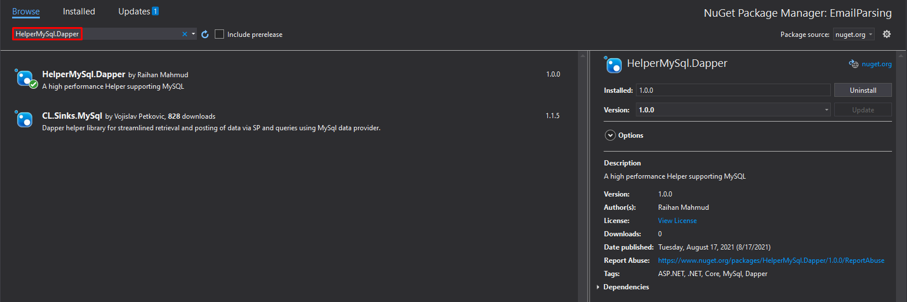

# HelperMySql.Dapper

   
  
  
  
  

## Objectives
A high performance Helper supporting MySQL.

## Instructions

+ **Installation**
    * Go to Solution » Manage NuGet Packages » Browse HelperMySql.Dapper
    * Install HelperMySql.Dapper
    
    
